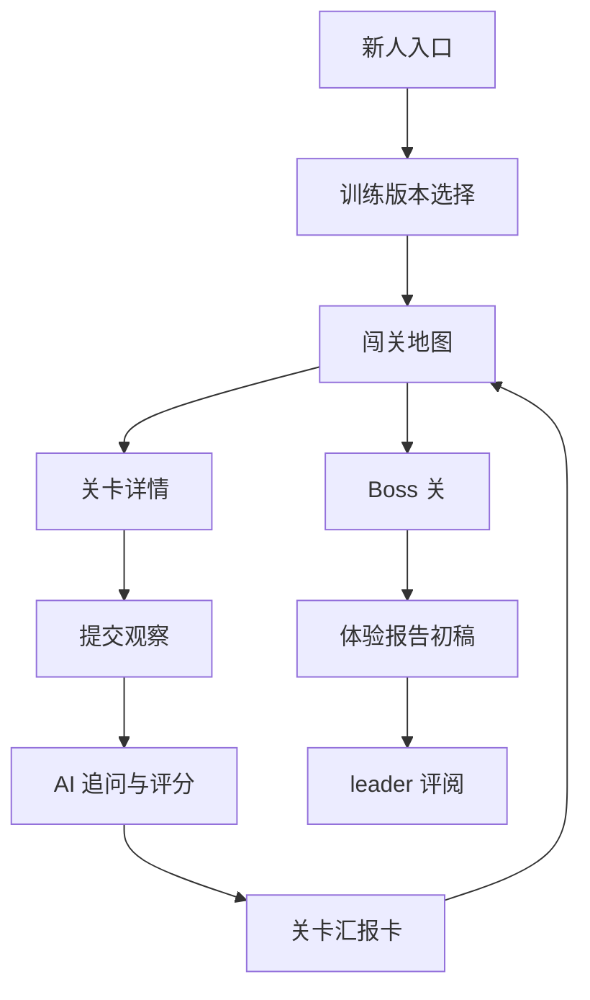

# MVP PRD：新人闯关训练产品

## 产品名称

生活服务新人闯关训练

## MVP 目标

让新人通过 6 个轻量关卡，完成对抖音生活服务生态、看评消费、评价生产和创作者路径的结构化体验，并生成一份产品体验报告。

## 用户故事

### 新人

作为新人，我希望有一套清晰的任务地图，而不是漫无目的刷 App，这样我能在低压力下完成产品体验报告。

### leader / 导师

作为导师，我希望看到新人每个关卡的观察过程和判断依据，而不是只看到最终报告，这样我能判断新人是否真正理解业务。

### 业务团队

作为团队，我希望新人训练材料可以复用和迭代，而不是每次都临时布置体验任务。

## MVP 范围

### 包含

- 新人入口说明
- 6 个标准关卡
- 1 个 Boss 报告关
- 每关提交模板
- 每关评分标准
- AI Game Master 追问和整理
- 最终体验报告模板

### 暂不包含

- 登录和账号系统
- 真实任务排行榜
- 复杂后台配置台
- 自动抓取抖音内容
- 与公司内部数据系统打通
- 多人协作评审流

## 核心流程

### Step 0 分诊

首次进入时，AI Game Master 先询问用户要做哪一步：

- A. 了解项目规则
- B. 开始第一关
- C. 继续未完成关卡
- D. 让 AI 追问我的观察
- E. 生成阶段汇报卡
- F. 生成最终体验报告

用户选择后，只聚焦当前步骤，不一次性展开全部任务。

### Step 1 选择训练版本

MVP 默认使用标准版。

| 版本 | 适用对象 | 关卡 |
|---|---|---|
| 轻量版 | 时间少的新人 | 消费者找店、看评决策、报告生成 |
| 标准版 | 产品/运营新人 | 6 关 + Boss 关 |
| 专题版 | 已明确业务方向的人 | 商品评价、地点评价、直播链路等专题 |

### Step 2 完成关卡

每关包含：

- 任务目标
- 体验路径
- 观察清单
- 提交模板
- AI 追问
- 评分 rubric
- 徽章

### Step 3 阶段汇报卡

每完成一关，输出一张汇报卡：

```text
关卡：
完成状态：
核心观察：
证据材料：
产品问题：
机会点：
待验证问题：
AI 评分：
下一关建议：
```

### Step 4 Boss 关生成报告

AI 汇总全部关卡材料，生成产品体验报告初稿。用户再人工修改，补充真实案例和判断。

## 信息架构



## 关键页面

### 新人首页

- 当前训练主题
- 已完成关卡数
- 下一关入口
- 最终报告进度

### 关卡详情页

- 任务背景
- 需要体验的路径
- 观察问题
- 提交格式
- 可选支线

### 提交页

- 场景
- 用户目标
- 体验路径
- 关键截图或链接
- 有用评价样本
- 无效评价样本
- 产品问题
- 机会点

### 报告页

- 自动汇总关卡材料
- 展示报告结构
- 支持人工改写
- 输出 Markdown / Doc / 飞书文档

## 评分维度

| 维度 | 权重 | 说明 |
|---|---:|---|
| 用户目标清晰度 | 20 | 是否明确自己代入了什么用户场景 |
| 证据充分度 | 20 | 是否有截图、路径、样本或具体现象 |
| 产品归因能力 | 25 | 是否能从体感上升到机制、路径或信息问题 |
| 业务关联度 | 20 | 是否关联评价生产、消费决策、创作者或商家价值 |
| 机会点质量 | 15 | 是否提出可验证、可落地的优化方向 |

## MVP 验收标准

- 你能基于 6 关材料写出一版体验报告。
- 至少 4 个关卡能产出明确产品问题。
- 最终报告至少包含 3 个高质量机会点。
- 关卡规则可以被另一个新人读懂并独立完成。

## 已知风险

| 风险 | 表现 | 应对 |
|---|---|---|
| 游戏化过重 | 新人只关注徽章，不关注观察 | 第一版只做轻量徽章，不做复杂积分 |
| 任务太宽 | 新人不知道体验什么 | 每关限制具体路径和提交模板 |
| 观察太主观 | 报告像吐槽 | AI 必须追问用户目标、证据和归因 |
| 报告太空 | 只有宏观判断 | 每个结论必须绑定至少一个关卡观察 |
| 体验成本高 | 变成额外负担 | 每关控制 20-40 分钟 |
