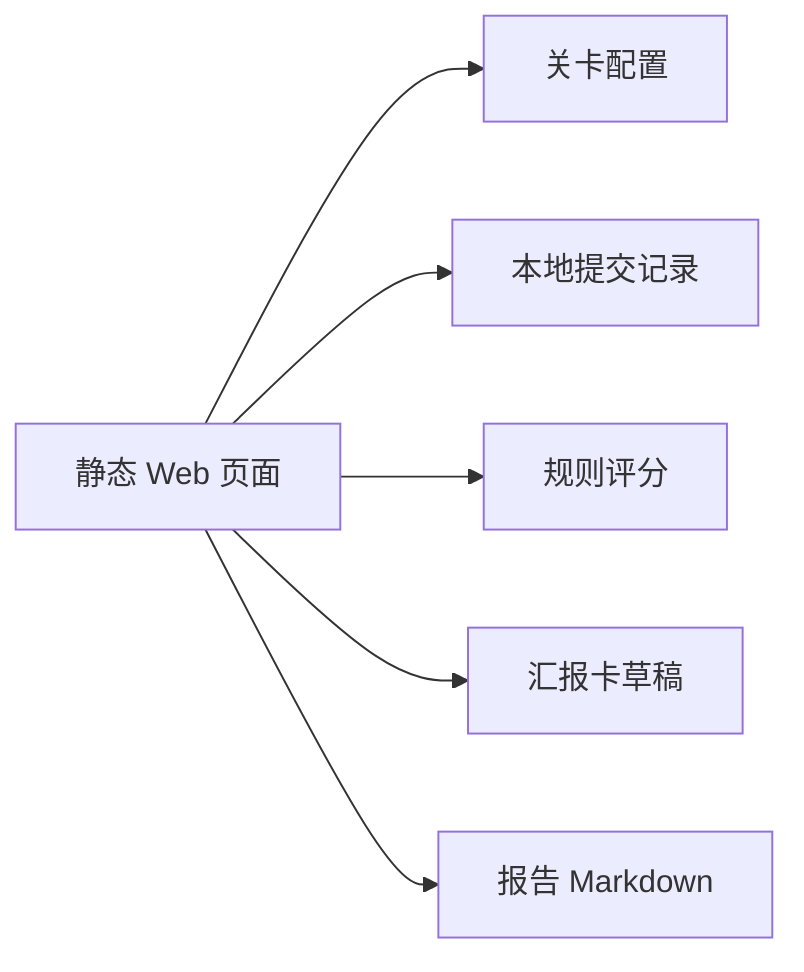
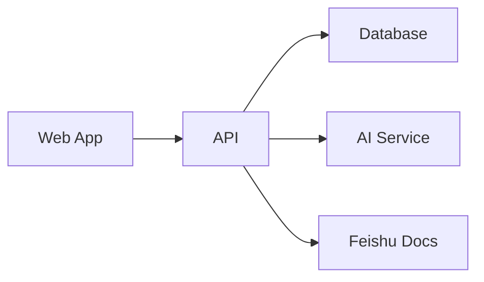

# Architecture Review：生活服务新人闯关训练平台

## 1. 总体判断

当前设计作为 PDE 项目的 MVP 是合理的：它先用静态 Web 验证核心交互，而不是过早引入后端、账号、权限、AI 服务和部署复杂度。

最重要的架构判断是：

> 当前阶段的核心风险不是技术实现难度，而是产品交互和训练机制是否成立。因此用静态页面 + localStorage 做 MVP 是合适的。

## 2. 当前架构



### 优点

- 启动成本低：打开 HTML 即可试用。
- 验证速度快：能快速改关卡、表单和报告结构。
- 数据结构清楚：Level、Submission、AppState 三层足够支撑 MVP。
- 没有外部依赖：适合早期在不确定需求下快速迭代。

### 主要不足

- 配置写死在 `app.js`，后续需要迁移到 JSON/YAML 或服务端配置。
- localStorage 只适合单机试跑，不适合团队复用。
- 规则评分只能做占位，不能替代 AI Game Master。
- 关卡 2 这类多样本任务需要更强的数据结构，不适合简单平铺字段。
- 缺少 leader 评阅视图，团队复用价值还没闭环。

## 3. 架构合理性评估

| 维度 | 评价 | 说明 |
|---|---|---|
| MVP 适配度 | 高 | 静态 Web 足够验证闯关体验 |
| 可扩展性 | 中 | 需要尽快抽离配置和生成逻辑 |
| 数据模型 | 中 | 单层 values 简单，但对多样本任务不够自然 |
| AI 接入预留 | 中 | 有接口设想，但还未模块化 |
| 团队复用 | 低到中 | 缺少账号、权限、评阅和服务端存储 |
| 部署复杂度 | 低 | 当前可直接静态部署 |

## 4. 推荐演进路线

### Phase 1：交互模型稳定

继续保持静态 Web，不急着上框架。

目标：

- 支持多样本关卡。
- 支持复制阶段汇报卡。
- 支持导入/导出演示数据。
- 把真实试跑跑通。

### Phase 2：代码模块化

当页面逻辑继续增长时，再拆分：

```text
web/
  index.html
  styles.css
  app.js
  levels.js
  storage.js
  scoring.js
  report.js
```

触发条件：

- `app.js` 超过 600 行。
- 需要多个页面。
- 需要 AI 调用、飞书同步或部署构建。

### Phase 3：AI Game Master

接入 AI 后，建议把 AI 能力分成四类：

- 追问：补证据和归因。
- 评分：按 rubric 给分。
- 汇报卡：生成阶段产物。
- 报告：汇总最终报告。

不要让一个大 prompt 同时做所有事。

### Phase 4：团队复用

引入后端或数据库：



需要支持：

- 多新人训练记录
- leader 评阅
- 模板配置
- 报告同步

## 5. 当前最该改的点

优先级从高到低：

1. 关卡 2 支持 3 个样本对象的结构化填写。
2. 阶段汇报卡支持复制，方便粘贴到飞书或报告。
3. 加入演示数据导入，方便向 leader 展示。
4. 增强状态反馈，让用户知道当前关卡是否足够完成。
5. 后续再拆分 JS 模块和接 AI。

## 6. 结论

当前项目方向是合理的，但需要继续坚持一个原则：

> 先把核心用户体验跑通，再升级技术栈。

短期不建议引入 React、后端或数据库。等关卡机制、报告机制和 leader 评阅模式被验证后，再做工程升级。
