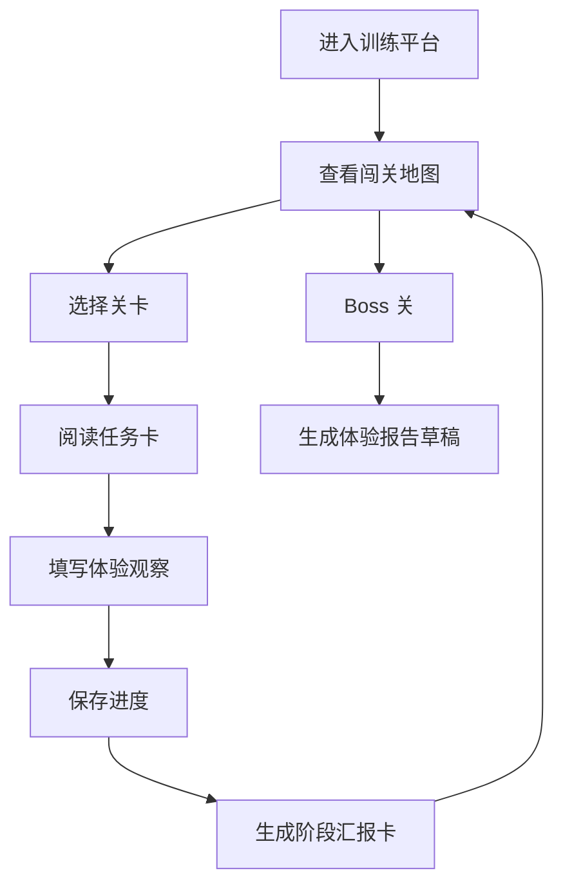

# PRD：生活服务新人闯关训练平台

## 1. 背景

新人第一周通常会被要求完成产品体验报告，例如「以用户视角了解抖音生态、创作者路径和看评消费体验」。如果只依赖文档填写，容易出现三个问题：

1. 体验路径不受控，新人容易漫无目的刷 App。
2. 观察质量不可评价，leader 只能看到最终报告，看不到过程。
3. 产出不可复用，每个新人都从零开始。

本项目将一次性体验报告任务产品化为「新人闯关训练平台」：通过关卡地图、结构化提交、AI Game Master 追问评分和报告生成，把新人体验过程沉淀为可复用的训练机制。

## 2. 产品定位

面向生活服务业务新人的游戏化产品体验训练工具。

首个业务主题：抖音生活服务评价生产与看评消费体验。

## 3. 目标用户

| 用户 | 诉求 |
|---|---|
| 新人产品/运营 | 有清晰任务，不知道怎么体验时有人引导，最终能产出报告 |
| leader/导师 | 看见新人观察过程、判断能力和报告质量 |
| 业务团队 | 复用新人训练机制，沉淀高质量样本和方法论 |

## 4. 核心目标

### MVP 目标

- 支持 6 个关卡的任务查看与提交。
- 支持本地保存进度。
- 支持按关卡字段结构化记录体验观察。
- 支持自动生成阶段汇报卡草稿。
- 支持生成最终体验报告草稿。

### 非目标

- 不做完整权限系统。
- 不接入抖音数据抓取。
- 不做复杂排行榜或社交机制。
- 第一版不依赖后端服务。

## 5. 核心流程

## 6. 功能需求

### 6.1 闯关地图

展示 6 个标准关卡和 Boss 关。

字段：

- 关卡名称
- 训练视角
- 预计耗时
- 徽章
- 完成状态
- 评分

### 6.2 关卡任务页

展示：

- 任务目标
- 主线任务
- 提交字段
- 通过标准

### 6.3 观察提交

每个关卡根据配置生成表单。

提交字段来自 `config/levels.yaml` 的 `output`。

### 6.4 阶段汇报卡

根据用户填写内容生成初版汇报卡：

- 核心观察
- 证据材料
- 产品问题
- 机会点
- 待验证问题
- 评分
- 下一关建议

MVP 中先用规则模板生成，后续接入 AI Game Master。

### 6.5 报告生成

汇总所有关卡记录，生成 Markdown 格式体验报告草稿。

报告结构：

- 背景与体验范围
- 消费者看评链路观察
- 评价生产链路观察
- 创作者内容与评价关系
- 商品评价 vs 地点评价
- 关键问题归因
- 产品机会点
- 后续待验证问题

### 6.6 本地数据存储

MVP 使用浏览器 `localStorage` 存储用户提交。

支持：

- 自动保存
- 清空数据
- 导出 Markdown 报告

## 7. 评分规则

| 维度 | 权重 |
|---|---:|
| 用户目标清晰度 | 20 |
| 证据充分度 | 20 |
| 产品归因能力 | 25 |
| 业务关联度 | 20 |
| 机会点质量 | 15 |

MVP 先用填写完整度 + 关键词规则估算，后续由 AI 模型评分。

## 8. 页面清单

| 页面/区域 | 说明 |
|---|---|
| 顶部状态栏 | 项目名、完成进度、导出操作 |
| 左侧关卡地图 | 切换关卡、查看状态 |
| 中间任务工作区 | 关卡说明、表单、保存 |
| 右侧教练面板 | 汇报卡、评分、下一步建议 |
| 报告抽屉/区域 | 汇总报告草稿 |

## 9. MVP 验收标准

- 打开本地网页即可使用。
- 6 个关卡都能填写和保存。
- 切换关卡后数据不丢失。
- 至少能生成一张阶段汇报卡。
- 能生成一份 Markdown 报告草稿。
- 页面在 1366px 桌面和移动宽度下可用。

## 10. 后续迭代

### V1.1

- 接入真实 AI Game Master。
- 支持把汇报卡写入飞书文档。
- 支持截图/链接素材上传。

### V1.2

- 增加 leader 评阅视图。
- 增加样本库和优秀案例。
- 增加专题副本：商品评价、地点评价、直播链路。

### V2

- 飞书应用化。
- 多用户账号与权限。
- 后端保存训练记录。
- 训练模板后台配置。
