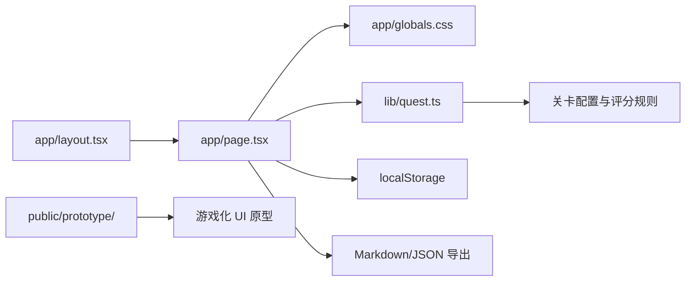

# 技术方案：生活服务新人闯关训练平台 MVP

## 1. 技术目标

第一版目标是快速验证产品交互和训练流程，同时让项目进入可持续维护的前端工程结构。

当前实现采用 Next.js App Router：

- 前端框架：Next.js + React + TypeScript。
- 暂不接后端。
- 数据仍存在浏览器 `localStorage`。
- 关卡、评分、汇报卡和报告生成逻辑集中在本地代码中。

## 2. 架构



## 3. 文件结构

```text
用户体验平台/
  app/
    layout.tsx
    page.tsx
    globals.css
  lib/
    quest.ts
  public/
    prototype/
      prototype.html
      prototype.css
      prototype.js
  docs/
    PRD.md
    TECH_SPEC.md
  config/
    levels.yaml
```

## 4. 数据模型

### Level

```ts
type Level = {
  id: string;
  name: string;
  perspective: string;
  badge: string;
  estimatedMinutes: number;
  goal: string;
  mainTask: string;
  output: string[];
  passCriteria: string[];
  sections?: {
    title: string;
    fields: string[];
  }[];
};
```

### Submission

```ts
type Submission = {
  levelId: string;
  values: Record<string, string>;
  updatedAt: string;
  score?: number;
};
```

### AppState

```ts
type AppState = {
  activeLevelId: string;
  submissions: Record<string, Submission>;
};
```

## 5. 关键实现

### 5.1 页面组件

`app/page.tsx` 是客户端组件，负责：

- 关卡地图。
- 任务说明。
- 动态表单。
- 教练面板。
- 阶段汇报卡。
- 报告草稿。
- JSON 导出和本地数据清空。

### 5.2 关卡逻辑

`lib/quest.ts` 负责：

- 关卡数据。
- TypeScript 类型。
- 字段展开。
- 完成度判断。
- 规则评分。
- 时间格式化。

后续如果要把 `config/levels.yaml` 作为真正数据源，应先引入构建期 YAML 解析或改成 JSON。

### 5.3 自动保存

用户输入后写入 `localStorage`。

key 保持不变，避免迁移框架后丢失浏览器已有数据：

```text
life_service_onboarding_quest_state_v1
```

### 5.4 评分

MVP 使用规则评分：

- 字段填写完整度。
- 文本长度。
- 是否出现产品归因词：路径、信息、动机、评价、交易、POI、转化、供给、质量。
- 是否出现机会点。

后续替换为 AI Game Master API。

### 5.5 阶段汇报卡生成

MVP 规则模板：

- 抽取用户填写的前几项作为证据。
- 根据缺失字段给建议。
- 根据关卡 pass criteria 给下一步。

后续由 LLM 根据 Prompt 生成。

### 5.6 报告生成

遍历所有关卡 submissions，拼接 Markdown。

支持复制到剪贴板。

## 6. AI 接入预留

未来增加接口：

```ts
async function askGameMaster(level, submission) {
  return {
    followUpQuestions: [],
    score: 0,
    reportCard: ""
  };
}
```

可接入：

- OpenAI API
- 飞书机器人
- 内部大模型服务

## 7. 飞书集成预留

### 创建文档

使用 `lark-cli docs +create --api-version v2` 或后端飞书 OpenAPI。

### 写入汇报卡

用户点击「同步到飞书」后：

1. 获取当前关卡汇报卡。
2. 定位飞书文档对应章节。
3. 使用 `docs +update` 写入。

MVP 暂不做自动同步，避免权限和多人协作复杂度影响验证。

## 8. 风险与约束

| 风险 | 应对 |
|---|---|
| localStorage 只在本机可用 | MVP 可接受，后续接后端 |
| 规则评分不够智能 | 明确标注为草稿评分，后续接 AI |
| 依赖安装需要网络 | 首次运行需执行 `npm install` |
| 配置暂时写在 TS 中 | 后续再把 YAML/JSON 作为数据源 |

## 9. 验证方式

1. 执行 `npm install`。
2. 执行 `npm run typecheck`。
3. 执行 `npm run build`。
4. 执行 `npm run dev`。
5. 在浏览器中验证：
   - 关卡列表可切换。
   - 体验记录可自动保存。
   - 刷新后数据保留。
   - 阶段汇报卡可生成和复制。
   - Markdown 报告可生成和复制。
   - JSON 可导出。
   - 清空本地数据前有确认弹窗。
