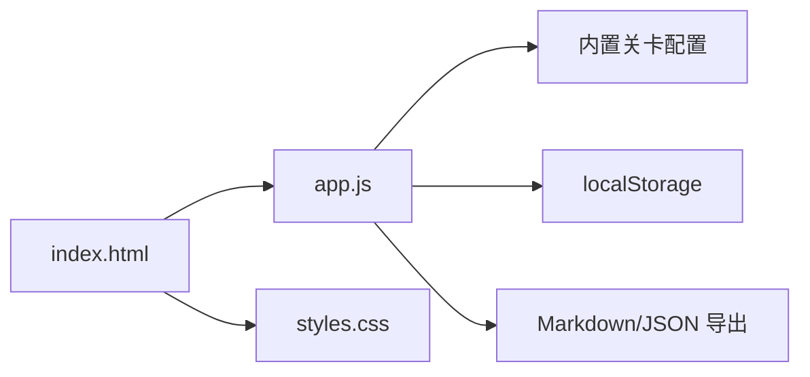

# 技术方案：生活服务新人闯关训练平台 MVP

## 1. 技术目标

第一版目标是快速验证产品交互和训练流程，不追求完整工程化。

采用静态 Web 实现：

- 无需后端。
- 无需安装依赖。
- 可直接打开 `web/index.html` 使用。
- 数据存在浏览器 `localStorage`。

## 2. 架构



## 3. 文件结构

```text
life_service_onboarding_quest/
  docs/
    PRD.md
    TECH_SPEC.md
  web/
    index.html
    styles.css
    app.js
```

## 4. 数据模型

### Level

```ts
type Level = {
  id: string;
  name: string;
  perspective: string;
  badge: string;
  estimatedMinutes: number;
  goal: string;
  mainTask: string;
  output: string[];
  passCriteria: string[];
};
```

### Submission

```ts
type Submission = {
  levelId: string;
  values: Record<string, string>;
  updatedAt: string;
  score?: number;
};
```

### AppState

```ts
type AppState = {
  activeLevelId: string;
  submissions: Record<string, Submission>;
};
```

## 5. 关键实现

### 5.1 表单生成

根据关卡配置中的 `output` 字段动态生成 textarea。

优点：

- 后续新增关卡不改页面结构。
- 关卡配置可以迁移到后端或 YAML 解析。

### 5.2 自动保存

用户输入后写入 `localStorage`。

key：

```text
life_service_onboarding_quest_state_v1
```

### 5.3 评分

MVP 使用规则评分：

- 字段填写完整度。
- 文本长度。
- 是否出现产品归因词：路径、信息、动机、评价、交易、POI、转化、供给、质量。
- 是否出现机会点。

后续替换为 AI Game Master API。

### 5.4 阶段汇报卡生成

MVP 规则模板：

- 抽取用户填写的前几项作为证据。
- 根据缺失字段给建议。
- 根据关卡 pass criteria 给下一步。

后续由 LLM 根据 Prompt 生成。

### 5.5 报告生成

遍历所有关卡 submissions，拼接 Markdown。

支持复制到剪贴板。

## 6. AI 接入预留

未来增加接口：

```ts
async function askGameMaster(level, submission) {
  return {
    followUpQuestions: [],
    score: 0,
    reportCard: ""
  };
}
```

可接入：

- OpenAI API
- 飞书机器人
- 内部大模型服务

## 7. 飞书集成预留

### 创建文档

使用 `lark-cli docs +create --api-version v2` 或后端飞书 OpenAPI。

### 写入汇报卡

用户点击「同步到飞书」后：

1. 获取当前关卡汇报卡。
2. 定位飞书文档对应章节。
3. 使用 `docs +update` 写入。

MVP 暂不做自动同步，避免权限和多人协作复杂度影响验证。

## 8. 风险与约束

| 风险 | 应对 |
|---|---|
| localStorage 只在本机可用 | MVP 可接受，后续接后端 |
| 规则评分不够智能 | 明确标注为草稿评分，后续接 AI |
| 静态页面无法上传素材 | 先支持文字和链接，后续加文件 |
| 配置写死在 JS | MVP 可接受，后续读取 JSON/YAML |

## 9. 验证方式

- 打开 `web/index.html`。
- 填写关卡 1 的真实观察。
- 保存后刷新页面，确认数据保留。
- 点击生成汇报卡，确认右侧面板更新。
- 点击生成报告，确认 Markdown 可复制。
