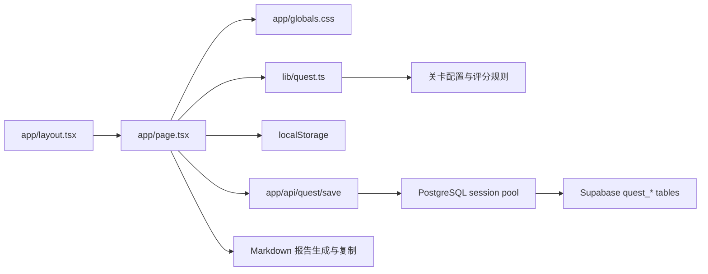

# 技术方案：生活服务新人闯关训练平台 MVP

## 1. 技术目标

第一版目标是快速验证产品交互和训练流程，同时让项目进入可持续维护的前端工程结构。

当前实现采用 Next.js App Router：

- 前端框架：Next.js + React + TypeScript。
- 后端接口：Next.js Route Handlers。
- 数据持久化：浏览器 `localStorage` 作为本地 fallback，后端通过 PostgreSQL session pool 写入 Supabase。
- 关卡、评分、汇报卡和报告生成逻辑集中在本地代码中。

## 2. 架构



## 3. 文件结构

```text
用户体验平台/
  app/
    api/
      quest/
        save/route.ts
        sessions/[sessionId]/route.ts
    layout.tsx
    page.tsx
    globals.css
  lib/
    quest.ts
    server/
      db.ts
      questRepository.ts
  docs/
    PRD.md
    TECH_SPEC.md
  config/
    levels.yaml
```

## 4. 数据模型

### Level

```ts
type Level = {
  id: string;
  name: string;
  perspective: string;
  badge: string;
  estimatedMinutes: number;
  goal: string;
  mainTask: string;
  output: string[];
  passCriteria: string[];
  sections?: {
    title: string;
    fields: string[];
  }[];
};
```

### Submission

```ts
type Submission = {
  levelId: string;
  values: Record<string, string>;
  updatedAt: string;
  score?: number;
};
```

### AppState

```ts
type AppState = {
  activeLevelId: string;
  submissions: Record<string, Submission>;
};
```

## 5. 关键实现

### 5.1 页面组件

`app/page.tsx` 是客户端组件，负责：

- 关卡地图。
- 任务说明。
- 动态表单。
- 教练面板。
- 阶段汇报卡。
- 报告草稿。
- 当前下一步提示和下一关跳转。

### 5.2 关卡逻辑

`lib/quest.ts` 负责：

- 关卡数据。
- TypeScript 类型。
- 字段展开。
- 完成度判断。
- 规则评分。
- 时间格式化。

后续如果要把 `config/levels.yaml` 作为真正数据源，应先引入构建期 YAML 解析或改成 JSON。

### 5.3 自动保存

用户输入后仍写入 `localStorage`，用于刷新恢复和后端失败时的本地 fallback。

key 保持不变，避免迁移框架后丢失浏览器已有数据：

```text
life_service_onboarding_quest_state_v1
```

用户点击「保存并验证入库」后，前端调用 `POST /api/quest/save`，由服务端通过 `DATABASE_URL` 创建 PostgreSQL 连接池并写入 Supabase：

- `quest_sessions`：匿名训练会话。
- `quest_level_submissions`：每个会话每关一条提交记录。
- `quest_submission_fields`：当前关卡字段值，按字段 upsert。
- `quest_report_artifacts`：阶段汇报卡和最终报告草稿。

后端返回 `sessionId`、`savedFieldCount`、`savedAt` 和 `verified`。前端把 `sessionId` 存入：

```text
life_service_onboarding_quest_session_id_v1
```

后续同一浏览器继续保存时复用这个匿名会话。

后端配置健康检查由 `GET /api/quest/health` 提供，只返回是否配置了数据库连接：

```json
{
  "databaseConfigured": true
}
```

本地开发必须复制 `.env.local.example` 为 `.env.local`，并把 `DATABASE_URL` 设置为 Supabase PostgreSQL session pooler 连接串。真实连接串不得提交到仓库，也不应出现在前端代码、聊天记录或文档中。

### 5.4 评分

MVP 使用规则评分：

- 字段填写完整度。
- 文本长度。
- 是否出现产品归因词：路径、信息、动机、评价、交易、POI、转化、供给、质量。
- 是否出现机会点。

后续替换为 AI Game Master API。

### 5.5 NPC / Agent 引导

右侧教练面板升级为 Game Master / NPC 教练：

- 虚拟形象：使用「阿引」插画头像作为固定 Game Master 向导，展示当前 provider 和处理状态。
- 空白状态：解释当前关卡目标，提示优先填写字段。
- 问答中：用户通过输入框直接向「阿引」提问，后端按 `guide_chat` 模式回答。
- 保存入库后：生成本关导师点评、过关判断和下一关建议。
- 多关完成后：生成 Markdown 体验报告草稿。

后端通过 `POST /api/quest/coach` 生成 Agent 产物。默认 provider 为 `rules`，不外发用户填写内容；只有显式设置 `QUEST_AGENT_PROVIDER=agnes` 或 `QUEST_AGENT_PROVIDER=openai` 且配置对应后端密钥时，服务端才调用外部模型。模型调用失败、额度不足、超时或返回格式不合法时，自动回退规则 Agent，并在响应里返回 `fallbackReason`。

### 5.6 报告生成

遍历所有关卡 submissions，拼接 Markdown。

支持复制到剪贴板。

## 6. AI 接入

当前已预留混合 Agent：

```ts
type QuestCoachMode = "pre_submit_hint" | "field_followup" | "post_submit_review" | "final_report" | "guide_chat";

type QuestCoachRequest = {
  mode: QuestCoachMode;
  userQuestion?: string;
};

type QuestCoachResponse = {
  roleName: string;
  messageMarkdown: string;
  followUpQuestions: string[];
  nextAction: string;
  reportMarkdown?: string;
  provider: "rules" | "openai" | "agnes";
  fallbackReason?: string;
};
```

可接入：

- 默认规则 Agent：本地生成提示、追问、点评和报告草稿。
- Agnes OpenAI-compatible Chat Completions：设置 `QUEST_AGENT_PROVIDER=agnes`、`AGNES_API_KEY`、`AGNES_BASE_URL`、`AGNES_MODEL` 后启用，优先调用，失败时自动回退规则 Agent。
- OpenAI Responses API：显式配置后启用，失败时自动回退规则 Agent。
- 内部大模型服务：后续可复用 `questCoachService` 的 provider 分发方式。

密钥只允许放在 `.env.local` 或部署环境变量中，不写入仓库、文档、前端代码或聊天记录。

## 7. 飞书集成预留

### 创建文档

使用 `lark-cli docs +create --api-version v2` 或后端飞书 OpenAPI。

### 写入汇报卡

用户点击「同步到飞书」后：

1. 获取当前关卡汇报卡。
2. 定位飞书文档对应章节。
3. 使用 `docs +update` 写入。

MVP 暂不做自动同步，避免权限和多人协作复杂度影响验证。

## 8. 风险与约束

| 风险 | 应对 |
|---|---|
| localStorage 只在本机可用 | MVP 可接受，后续接后端 |
| 规则评分不够智能 | 明确标注为草稿评分，后续接 AI |
| 依赖安装需要网络 | 首次运行需执行 `npm install` |
| 配置暂时写在 TS 中 | 后续再把 YAML/JSON 作为数据源 |

## 9. 验证方式

1. 执行 `npm install`。
2. 执行 `npm run typecheck`。
3. 执行 `npm run build`。
4. 执行 `npm run dev:local`。
5. 在浏览器中验证：
   - 关卡列表可切换。
   - 体验记录可自动保存。
   - 刷新后数据保留。
   - 阶段汇报卡可生成和复制。
   - Markdown 报告可生成和复制。
